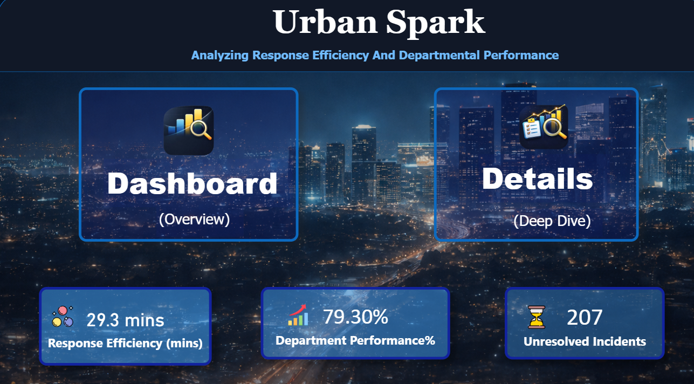
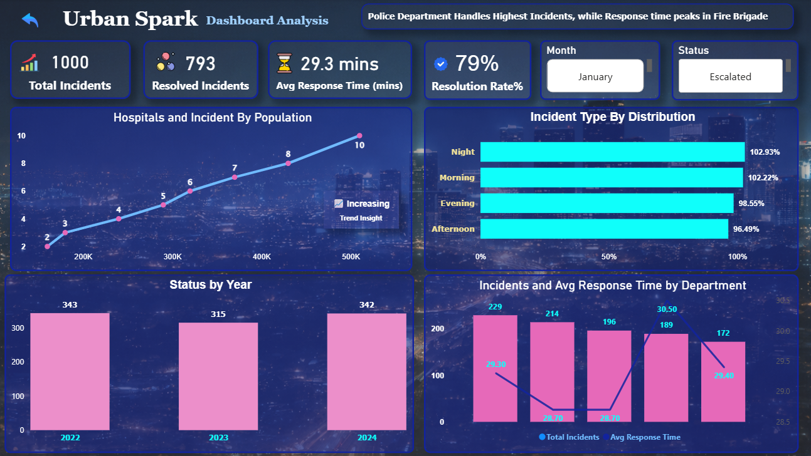
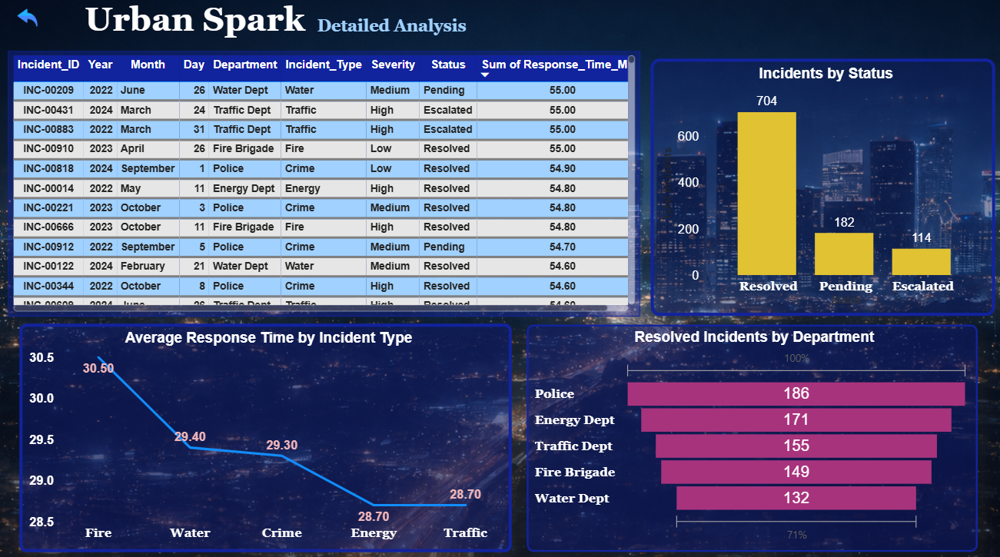

<h1 align="center">🌆 Urban Spark</h1>
<h3 align="center">📊 Analyzing Response Efficiency & Departmental Performance</h3>

  
  
  

<h2>📌 Project Overview</h2>

Urban Spark is a Power BI dashboard project designed to analyze city incident data,
focusing on response efficiency and departmental performance.
The dashboard provides actionable insights into incident handling,
resolution rates, and operational trends across different departments.

<h2>🎯 Objectives</h2>
<ul>
  <li>Analyze total incidents and resolution trends</li>
  <li>Measure average response time across departments</li>
  <li>Identify high-performing and underperforming departments</li>
  <li>Track unresolved and escalated incidents</li>
</ul>

<h2>📊 Key KPIs</h2>
<ul>
  <li>📈 Total Incidents: 1000</li>
  <li>✅ Resolved Incidents: 793</li>
  <li>⏱️ Avg Response Time: 29.3 mins</li>
  <li>📊 Resolution Rate: 79%</li>
  <li>⚠️ Unresolved Incidents: 207</li>
</ul>

<h2>📂 Dashboard Sections</h2>

<h3>1️⃣ Overview Dashboard</h3>
<ul>
  <li>Summary KPIs for quick insights</li>
  <li>Incident distribution by time (Morning, Evening, Night)</li>
  <li>Year-wise incident trends</li>
  <li>Department-wise incidents vs response time</li>
</ul>

<h3>2️⃣ Detailed Analysis</h3>
<ul>
  <li>Incident-level data table</li>
  <li>Incident status distribution (Resolved, Pending, Escalated)</li>
  <li>Average response time by incident type</li>
  <li>Department-wise resolved incidents</li>
</ul>

<h2>📈 Insights Generated</h2>
<ul>
  <li>🚓 Police department handles the highest number of incidents</li>
  <li>🚒 Fire brigade shows peak response time delays</li>
  <li>🌙 Night incidents have the highest distribution</li>
  <li>⚠️ Significant number of incidents remain unresolved</li>
</ul>

<h2>⚙️ Tools & Technologies</h2>

<h2>📸 Dashboard Preview</h2>

    
    
  

<h2>🚀 Conclusion</h2>

This project demonstrates how Power BI can transform raw city data into actionable insights.
It helps stakeholders monitor performance, improve response efficiency,
and make informed decisions for better urban management.

<h3 align="center">✨ Built by Dhanvanti Chelani | Power BI & Data Analytics</h3>
